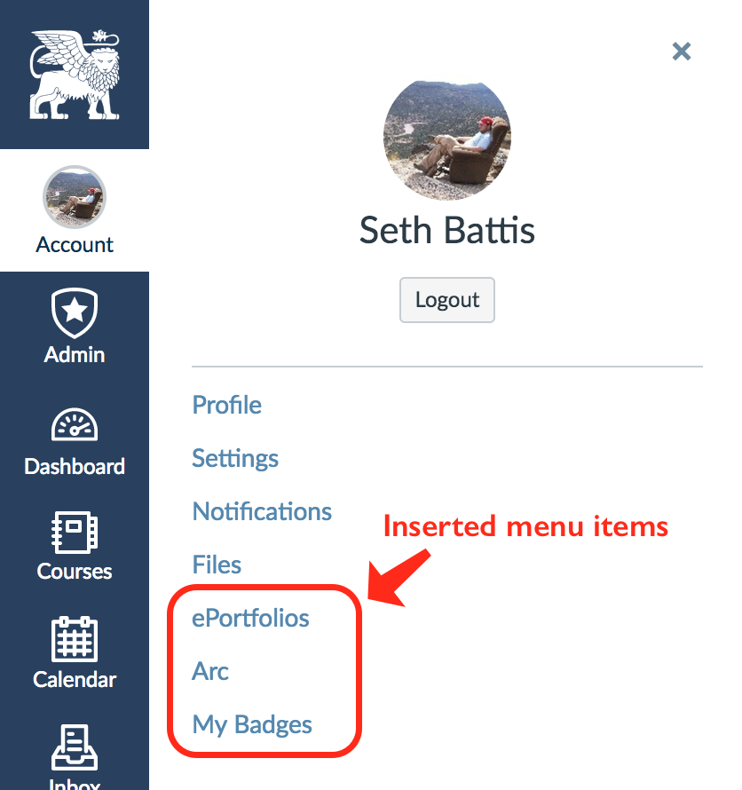

# Custom Global Navigation Flyout Items

Insert custom items into the global navigation fly-out menus

## Configuration

Should [CanvasHack](https://github.com/smtech/canvashack) ever get finished enough to support GUI configuration, this plugin really needs it. Right now there's some commented-out code in the `common.inc.php` file that demonstrates how to define add-in menu items. Right now the only variable that gets replaced is the current user ID (`@USER_ID`),
